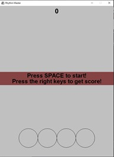
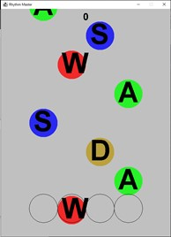
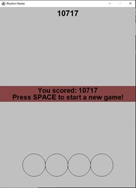
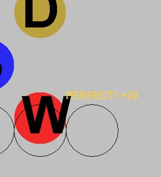
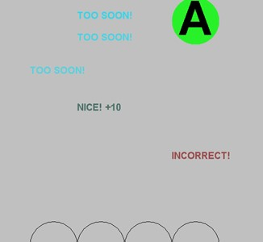

# 1.1 Rhythm Master Game Clone Overview

**Overview written by Peter Mitchell.**

## Contents

```
1.1 Rhythm Master Game Clone Overview
1.2 Introduction
1.3 The Rules of Rhythm Master
1.4 High Level Discussion About Implementation 
1.5 How the Core Game Works 
1.6 Features You Could Add 
```
# 1.2 Introduction

This document will explain the fundamentals of how the Rhythm Master game works.

# 1.3 The Rules of Rhythm Master

There are many different variations of the Rhythm genre. Titles such as Guitar Hero have
demonstrated the popularity. The basic formula of a Rhythm game is quite simple, but open to a lot
of interpretation. The following rules have been used to define this variation of the game.

- The game once started will have objects moving down the screen toward the player.
- Each object represents an individual character that must be pressed to successfully gain score.
- The objects are sequential so that pressing a character only compares against the next
    element moving down.
- Pressing the associated key too soon or too late, or the incorrect key award no score.
- Pressing the correct key as the character approaches the bottom will award the base amount
    of score and start a combo streak.
- Pressing the correct key in a small window near the bottom will award double points as a
    perfect move and also start a combo streak.
- Combo streaks continue for every correctly pressed (not missed) key in the sequence,
    increasing the score gained.
- After a fixed number of characters have moved down the screen the game ends with a final
    total score.


# 1.4 High Level Discussion About Implementation

The chosen implementation of the game uses a simple system of falling characters that appear in
random columns and must be pressed sequentially. To indicate the success or failure of presses a
fading text is shown to represent useful information.

  

When the game is opened you will see what is shown on the left side. Pressing SPACE would start the
game with randomly falling letters as seen in the middle. The goal is to press next letter that is close
to reaching the circle outline at the bottom. The screen on the right is shown when the game ends to
indicate the final score and allowing pressing of SPACE to return to the same screen on the left.

 

Above are shown some examples of the score being awarded. You can see an example of the
“PERFECT” on the left, and “TOO SOON!”, “NICE!” and “INCORRECT!” on the right. You can see the
area around where it chances from the “TOO SOON!” to “NICE!” is around where characters have to
reach before they are accepted for score.


# 1.5 How the Core Game Works

The setup for this game is quite simple. It draws on a lot of the code written for the other games
already with mostly only new code for the specific features that make it more unique. This section will
just quickly summarise in groups the different classes that are included. The classes are all fully
commented so you could browse the code if you had any specific elements you would like to know
more about.

Generic classes mostly taken from other games:

- MessagePanel: Mostly imitates the StatusPanel from the Battleship game. It simply displays
    the background rectangle for a pair of text lines.
- Position: Used in most of the games to represent an X and Y coordinate. Used for all the
    moving elements in the scene.
- Rectangle: Used to give a width and height along with a position to elements in the scene.
- Game: The Game class is nearly identical to the Battleship one with a few minor changes
    mostly just to the comments.

Game Elements:

- FadingEventText: A simple object that just gradually fades out a line of text while moving it
    upward to make the text for score visually interesting.
- GamePanel: Drives the game with managing most of the state functionality and interaction
    between components.
- RhythmElement: Defines a single falling letter to represent it visually and also to maintain the
    character that should be pressed to successfully gain score for it.

# 1.6 Features You Could Add

There are many small changes that could be made to modify the game as it currently is. The following
list summarises some of these possible changes.

- Add a high score feature, currently the score is removed at the end of each game. Make this
    more interesting by challenging yourself or others to reach a new high score.
- Consider changing the rules to something similar to Guitar Hero where the elements do not
    appear in random columns. Instead, each colour represents a specific key that must be
    pressed. And in some cases, held down for periods of times.
- Add a difficulty feature. Difficulty could be modified with a number of different variables (or
    additional ones) .In GamePanel, the TOTAL_SPAWNS controls the number of total elements
    the player must play against, the timeBetweenSpawns controls how long there is between
    these spawns, speedFactor controls how fast the elements fall down the screen. By modifying
    these variables or perhaps the valid list of characters you can control how the game is played.
- Improve the visuals in some way. The current visual layout is very plain. Make it more exciting
    with some visual effects.
- Look at other rhythm type games for features they include and try to implement some of
    them.
- Come up with your own unique feature and try to add it.


